### Hi there 👋

I'm an open source developer creating and contributing to many different projects, while trying to expand my knowledge involving Java based projects.

For easy contact join my  or open an issue on the correct repo.

<!--
**tr7zw/tr7zw** is a ✨ _special_ ✨ repository because its `README.md` (this file) appears on your GitHub profile.

Here are some ideas to get you started:

- 🔭 I’m currently working on ...
- 🌱 I’m currently learning ...
- 👯 I’m looking to collaborate on ...
- 🤔 I’m looking for help with ...
- 💬 Ask me about ...
- 📫 How to reach me: ...
- 😄 Pronouns: ...
- ⚡ Fun fact: ...
-->
